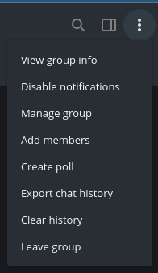
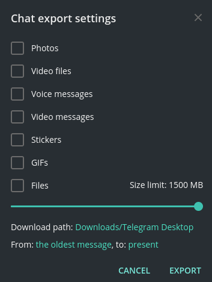
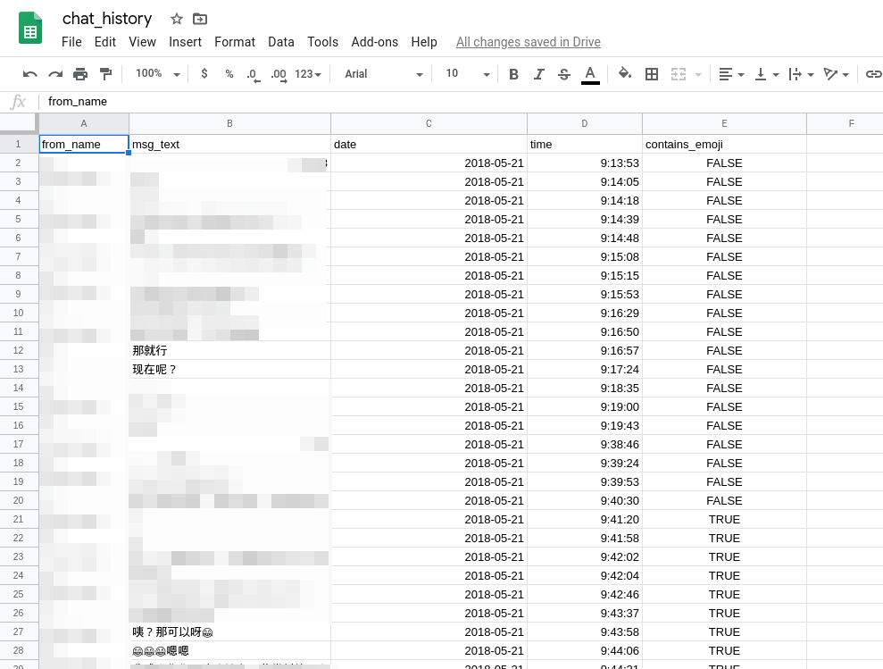
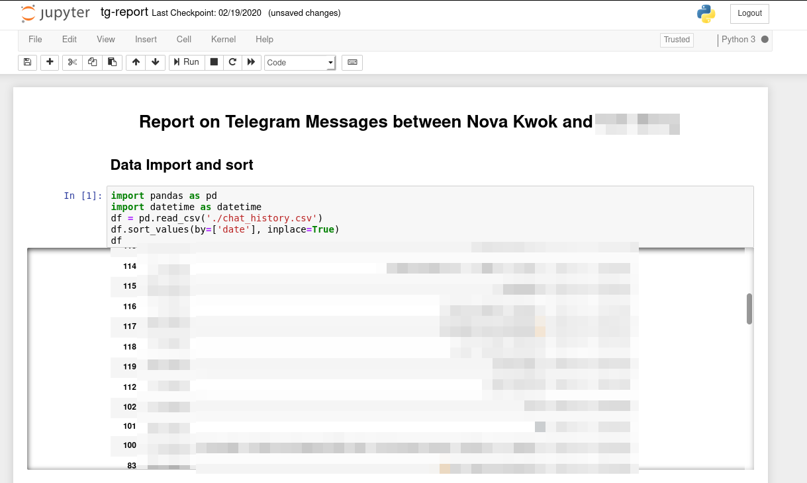
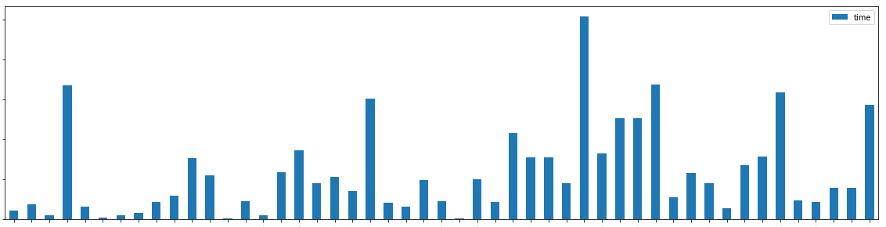
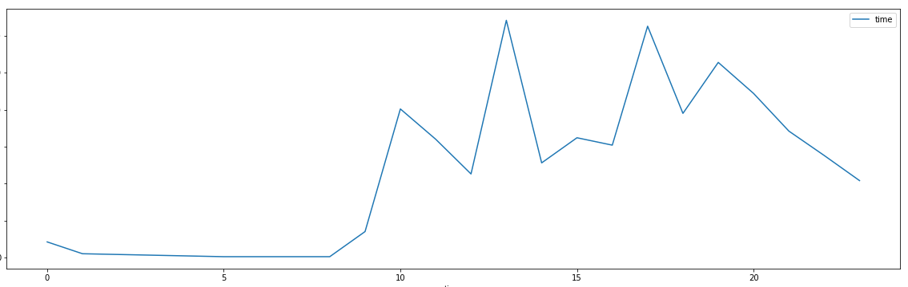

# Telegram Chat History Visualization

[](https://www.python.org/)

> “I would rather spend one lifetime with you, than face all the ages of this world alone.“
> 
>  J.R.R. Tolkien

## Prerequisite

```
pip3 install beautifulsoup4 emoji
```

## Usage

### Export the specific Telegram Chat History

Click 「Export chat history」 on the top right corner of Telegram Desktop.




In a typical export of Telegram message folder, there will be files like this:

```
.
├── css
│   └── style.css
├── images
├── js
│   └── script.js
├── messages2.html
├── messages3.html
├── messages4.html
├── messages5.html
├── messages.html
└── stickers
```

Just put the `parse.py` with those `.html`s.

### Parse the Logs

Run
```
python3 parse.py
```
and your chat log will be in `chat_history.csv` like this:



### Visualize those Logs

Run `tg-report.ipynb` in Jupyter Notebook, if you don't have one, you may try it out in [Google Colab](https://colab.research.google.com).



## Play with data

First of all, we can know how many chat items are there, maybe using WC?

```
➜  cat chat_history.csv | wc -l
629529
```

How many times we say "Good Night" to each other?

```
➜  cat chat_history.csv | grep "晚安" | wc -l
504213
```

Wow, the "Good Night rate" is about 80%.

## Visualizations

Here are the example visualizations with generated data samples.

### Date-Chat Chart



### Time-Chat Chart



### Wordcloud

Of course we have this feature, but due to the possiblity of leaking sensitive data, I cannot provide a screenshot here, it's for your discovery.